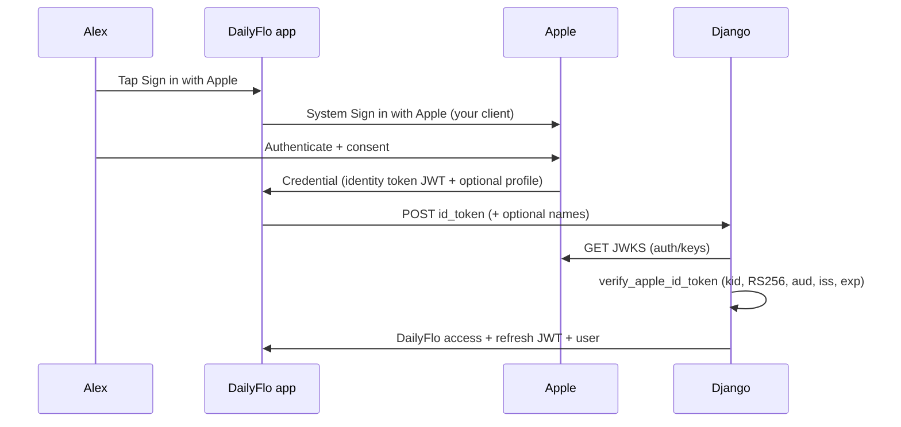

# Apple authentication — mental model for DailyFlo

This guide explains **how Sign in with Apple fits DailyFlo end-to-end**: identity tokens, JWKS verification, what Django checks, and how that differs from Google’s helper-based path and from automated tests. It is written **tutorial-style** with **scenarios** and explicit **purposes** so you can reason about the flow without memorizing jargon.

**How to read it:** follow Parts **0 → 8** in order. **Part 4** is the main “Alex signs in” story. Skip Part 0 if you already know JWT basics.

**Related code:** `backend/dailyflo/apps/accounts/social_auth.py` (`verify_apple_id_token`, `_fetch_apple_public_keys`), `SocialAuthView`, `SocialAuthSerializer` (`provider: apple`, optional `first_name` / `last_name`), `apps/accounts/tests/test_social_auth.py` (`VerifyAppleIdTokenTests`). Frontend: Expo **AppleAuthentication** / native Sign in with Apple (see `social-auth-implementation-plan.md`).

### Full Apple auth flow (arrows)

Alex taps **Sign in with Apple** →  
DailyFlo invokes Apple’s **system** Sign in with Apple UI (Apple’s sheet—not DailyFlo’s password field) →  
Alex authenticates with Apple (Face ID, Touch ID, passcode, or Apple ID step-up—DailyFlo never sees an Apple password) →  
Apple completes the flow **on the device** and returns a **credential** to the app (**identity token** JWT string, stable **`user`** id, and optionally **email** / **full name**—often **only on first authorization**) →  
The app **POST**s JSON to Django’s social-auth endpoint with **`provider: apple`**, **`id_token`** (the Apple identity JWT string), and optionally **`first_name`** / **`last_name`** when Apple supplied name on first sign-in →  
Django runs **`verify_apple_id_token`**: reads **`kid`** from the JWT header, **GET**s Apple’s JWKS, picks the matching public key, verifies **RS256** signature, then checks **`exp`**, **`iss`**, and **`aud`** against **`APPLE_CLIENT_ID`** →  
If verification succeeds, Django finds or creates **`CustomUser`** using **`sub`** (and email rules when Apple shares a real or relay address—otherwise a synthetic placeholder), then issues **DailyFlo access and refresh JWTs** →  
The app stores DailyFlo’s JWTs securely (e.g. SecureStore) and sends **`Authorization: Bearer`** plus the DailyFlo access token on subsequent requests →  
Apple’s identity token is **not** your session token for DailyFlo APIs; **DailyFlo JWTs** are. Apple does not require you to store its tokens server-side for login.

---

## Part 0 — Concepts in one place

### Step 0.1 — What a JWT is (short)

A **JWT** (JSON Web Token) is a compact string: **header.payload.signature**.

| Piece | Purpose |
|-------|---------|
| **Header** | Says how it was signed (typically **RS256**) and includes **`kid`** (which key in Apple’s JWKS signed this token). |
| **Payload** | **Claims**: facts about the login (`sub`, `aud`, `exp`, `iss`, email sometimes, …). |
| **Signature** | Cryptographic proof that **Apple** (holder of the private key) issued this payload—not your app, not the user typing bytes. |

Your backend **verifies** the signature using Apple’s **public** keys from **JWKS** before trusting any claim.

---

### Step 0.2 — Identity token vs DailyFlo JWT

Sign in with Apple focuses on **identity**. Keep names straight:

| Token | Typical purpose | DailyFlo usage |
|-------|-----------------|----------------|
| **Apple identity token** | Proof of **who** signed in (`sub`, `aud`, `iss`, …). Email may appear depending on user choice (real, hidden relay, or absent later). | Sent from app → Django in **`id_token`**; verified by **`verify_apple_id_token`**. |
| **Apple authorization code** (other flows) | Exchanging for tokens **server-to-server**—used in **backend-hosted** OAuth variants; DailyFlo’s mobile-forwarded **`id_token`** path does not require storing this for core login. | Not part of the current **`SocialAuthSerializer`** shape unless you add a separate flow. |
| **DailyFlo access / refresh JWT** | Proof for **your** APIs (`Authorization: Bearer …`). | Issued by Django **after** the Apple identity token verifies and the user row exists—**different** secret and lifetime from Apple’s token. |

**Scenario:** Alex finishes Sign in with Apple. The phone holds Apple’s credential once; after your **`POST`**, it holds **DailyFlo** JWTs for API calls. Do not send Apple’s token as **`Authorization`** to DailyFlo—use **DailyFlo access**.

---

## Part 1 — `APPLE_CLIENT_ID` (what it must match)

### Step 1.1 — Not a per-user id

**`APPLE_CLIENT_ID`** in Django **must equal** the **`aud`** claim inside the identity token—the OAuth client Apple minted that JWT **for** (often your **bundle identifier** for a native app, or a **Services ID** for web/certain configurations, depending on how Sign in with Apple is set up in Apple Developer).

**Purpose:** Pin verification so tokens minted for **another** app cannot unlock your API.

**Not:** A per-user identifier. **`sub`** identifies the user inside the token.

---

### Step 1.2 — Why Playground-style mismatch matters

If you obtain tokens from **Simulator / TestFlight / production** with one client configuration but Django’s **`APPLE_CLIENT_ID`** expects **`aud`** from **another** registration, verification fails—same **idea** as Google’s Web vs iOS client mismatch, different console (Apple Developer vs Google Cloud).

**Fix:** Align **`APPLE_CLIENT_ID`** with the **exact** client id Apple puts in **`aud`** for the build you are testing.

---

## Part 2 — Claims that matter: `aud` vs `sub`

Inside the **Apple identity token** payload:

### Step 2.1 — `sub` (subject)

**What it is:** Stable identifier for **that Sign in with Apple user** for **your** team’s apps (paired with `aud`).

**Purpose:**

- Primary key for **`get_or_create`** with **`auth_provider='apple'`** and **`auth_provider_id`**.
- Prefer **`sub`** over email: Apple may hide email, use **Hide My Email** relay addresses, or omit email on later sign-ins.

---

### Step 2.2 — `aud` (audience)

**What it is:** The **client id** (bundle / Services ID string) this token was minted **for**.

**Purpose:**

- Bind the login to **your** Sign in with Apple configuration.
- **`jwt.decode(..., audience=settings.APPLE_CLIENT_ID)`** rejects tokens for other apps.

---

### Step 2.3 — How they work together

| Claim | Answers | Purpose |
|-------|---------|---------|
| **`aud`** | **Which app registration** was this login for? | Must match **`APPLE_CLIENT_ID`**. |
| **`sub`** | **Which Apple user** (for this client)? | Stable linking in **`CustomUser`**. |

Apple signs **one** JWT that asserts both.

---

## Part 3 — Who verifies what (trust boundaries)

### Step 3.1 — The phone must not be the authority

The app **may** read the JWT for debugging; **never** trust client-side parsing as proof—malicious clients can forge payloads.

**Purpose of server verification:** Only Django, using **`verify_apple_id_token`** (**PyJWT** + Apple **JWKS** + **`APPLE_CLIENT_ID`**), decides whether the identity token is genuine and intended for your app.

---

### Step 3.2 — Why Apple’s verifier looks different from Google’s

| Layer | Responsibility |
|-------|----------------|
| **`verify_apple_id_token`** | Read **`kid`** → **`GET`** `https://appleid.apple.com/auth/keys` → match key → **RS256** verify → enforce **`aud`**, **`iss`**, **`exp`**; returns **claims** or raises **`ValueError`**. |
| **`verify_google_id_token`** | Delegates to **google-auth**’s **`verify_oauth2_token`** (JWKS and issuer checks **inside** the library). |

**Same security goal** (signed JWT, correct audience, not expired); **different Python surface area**—Apple has no single **`google-auth`**-equivalent bundled in DailyFlo, so the code uses **explicit JWKS fetch + `jwt.decode`**.

---

### Step 3.3 — What `SocialAuthView` adds

| Layer | Responsibility |
|-------|------------------|
| **`verify_apple_id_token`** | Pure verification—no database. |
| **`SocialAuthView`** | Calls verifier → builds email (including synthetic when Apple omits email) → conflict check → **`get_or_create`** → **`get_tokens_for_user`** → returns DailyFlo **access** / **refresh**. |

Optional **`first_name`** / **`last_name`** exist because Apple often delivers **full name only once** via the **credential**, not inside the JWT—clients forward those when present.

---

## Part 4 — End-to-end flow (Alex signs into DailyFlo)

Plain sequence:

1. Alex opens DailyFlo and taps **Sign in with Apple**.
2. **Apple’s system UI** appears; Alex completes authentication. DailyFlo never sees Alex’s Apple password.
3. Apple returns a **credential** to the app: **`identityToken`** (JWT string), **`user`** (stable string for your app), and optionally **email** and **name** (name commonly **first sign-in only**).
4. The app **POST**s **`provider: apple`**, **`id_token`**, and optional **`first_name`** / **`last_name`** to Django’s social endpoint.
5. Django runs **`verify_apple_id_token`** (JWKS + signature + **`aud`** / **`iss`** / **`exp`**).
6. On success, the view uses **`sub`** and email rules to find or create **`CustomUser`**, then returns **DailyFlo** JWT **access** / **refresh**.
7. The app stores DailyFlo tokens (e.g. SecureStore) and uses **`Authorization: Bearer`** for API calls.

### Step 4.1 — Why Apple returns the credential to the **app** first

**Purpose:** Sign in with Apple is initiated by the **registered client** on the device. Apple delivers the result to that client. DailyFlo’s architecture mirrors Google here: **client obtains identity token → forwards **`id_token`** to Django**—not Apple POSTing straight to your server for this flow.

---

## Part 5 — Django configuration (`APPLE_CLIENT_ID`)

**Purpose:** Must equal **`aud`** for the identity tokens your app sends—whatever Apple Developer configuration produces for your Expo/native build.

**Scenario mismatch:** Token has **`aud`** = Services ID A, but **`.env`** has bundle id B → **`InvalidAudienceError`** path → **401**.

---

## Part 6 — Real devices vs unit tests

### Step 6.1 — Manual / QA testing

**What:** Run the app on **Simulator** or a **device**, complete Sign in with Apple, capture traffic or logs as needed.

**Purpose:** Prove end-to-end integration (correct **`aud`**, Apple consent, token reaches Django).

**Not:** A hosted “OAuth Playground” clone for Apple—teams usually test with **Apple Developer** test users and real flows.

---

### Step 6.2 — Unit tests (`apps/accounts/tests/test_social_auth.py`)

**Purpose:** **`VerifyAppleIdTokenTests`** builds a **real RS256 JWT** with a temporary key, mocks **`_fetch_apple_public_keys`** to return that key as JWKS, and asserts **`verify_apple_id_token`** succeeds or fails (expiry, missing **`APPLE_CLIENT_ID`**).

**What that proves:** Your JWKS wiring and **`jwt.decode`** options match production crypto.

**What it does not prove:** That Apple’s servers issued a specific token—that requires device / QA smoke tests.

---

## Part 7 — Failure scenarios (mental rehearsal)

| Scenario | What happens |
|----------|----------------|
| Token **expired** (`exp` past) | **`ExpiredSignatureError`** → normalized **`ValueError`** → **401**. |
| Wrong **`aud`** | **`InvalidAudienceError`** → **401**. |
| **`kid`** missing or key not in JWKS | **`ValueError`** before or during decode → **401**. |
| **`APPLE_CLIENT_ID`** unset | Fail fast (**`APPLE_CLIENT_ID is not configured`**). |
| JWKS **fetch** fails (network) | **`ValueError`** from **`_fetch_apple_public_keys`** → **401** (mapping in view). |
| Forged / tampered JWT | Signature verification fails → **401**. |

---

## Part 8 — Diagram (optional)



Plain-text summary:

```
Alex → Apple system UI → Apple → credential to APP → APP POSTs id_token → DJANGO fetch JWKS + verify → DJANGO issues DailyFlo JWT → APP stores DailyFlo tokens for API calls
```

---

## Quick glossary

| Term | Meaning |
|------|--------|
| **JWT** | Signed token with claims; Apple’s **identity token** is one kind. |
| **`APPLE_CLIENT_ID`** | Must match **`aud`**—your Sign in with Apple client configuration string. |
| **Identity token** | Apple’s proof of **who** signed in for **`aud`**. |
| **`aud`** | Which client this token was minted for—must match **`APPLE_CLIENT_ID`**. |
| **`sub`** | Stable subject for linking **`CustomUser`** with **`auth_provider='apple'`**. |
| **JWKS** | JSON Web Key Set—Apple’s published public keys at **`appleid.apple.com/auth/keys`**. |
| **`kid`** | Header field selecting **which** JWKS entry verifies this JWT. |
| **DailyFlo JWT** | Your API session tokens—issued **after** Apple verification succeeds. |

---

*Last aligned with DailyFlo social-auth implementation (Apr 2026). Implementation details may evolve—check `social-auth-implementation-plan.md` for numbered phases.*
