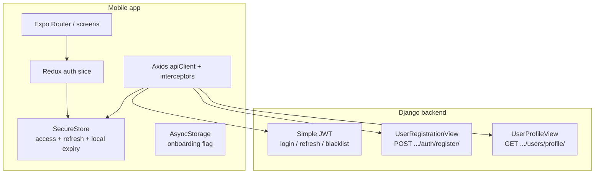

# Email / password authentication — tutorial-style guide (DailyFlo)

This guide walks **bottom-up**: concepts → backend contract → mobile storage → HTTP layer → Redux → navigation → **full worked flows** tied to real files. Scope is **email + password only** (social endpoints exist but are not treated as implemented).

**How to read it:** follow Parts **0 → 7** in order. Each “In this codebase” box tells you exactly where to look. Skip Part 0 if you already know JWT basics.

---

## Part 0 — Concepts you need first

### Step 0.1 — HTTP is stateless

Every HTTP request is independent. The server does not know “the same user” unless **each request carries proof**. Mobile apps usually send that proof as a header:

```http
Authorization: Bearer <access_token>
```

### Step 0.2 — Two tokens (access + refresh)

DailyFlo uses **django-rest-framework-simplejwt**. After login/register you get:

| Token | Typical use | In DailyFlo |
|--------|-------------|-------------|
| **Access** | Attach to normal API calls | Stored in SecureStore; attached by Axios |
| **Refresh** | Only to obtain a **new** access token when the old one expires | Stored in SecureStore; used by `checkAuthStatus` and the Axios 401 handler |

**Why two?** Short-lived access limits damage if leaked; long-lived refresh avoids logging in on every app open—but refresh must be stored securely and rotated/blacklisted carefully.

### Step 0.3 — Onboarding ≠ logged in

Two separate ideas:

| Idea | Stored where | Meaning |
|------|----------------|---------|
| “Has user finished first-run onboarding?” | AsyncStorage `@DailyFlo:onboardingComplete` | UX / tutorial state |
| “Is user logged in?” | JWT in SecureStore + Redux `isAuthenticated` | Security / API access |

They combine in routing (see Part 6).

---

## Part 1 — Big picture (where code runs)



Plain-text fallback:

```
+---------------------------+          HTTPS (JSON)           +---------------------------+
| MOBILE APP                |  <------------------------->  | DJANGO                    |
|  Screens -> Redux -> SecureStore                         |  JWT views + registration |
|  Axios -------------------------------------------------> |  Bearer + profile GET     |
|  AsyncStorage: onboarding only                           |                           |
+---------------------------+                                +---------------------------+
```

**In this codebase**

| Piece | Path |
|--------|------|
| Axios singleton + interceptors | `frontend/dailyflo/services/api/client.ts` |
| Secure token helpers | `frontend/dailyflo/services/auth/tokenStorage.ts` |
| Root navigation gate | `frontend/dailyflo/app/_layout.tsx` |

---

## Part 2 — Backend: URLs Django exposes

`backend/dailyflo/config/urls.py` mounts the accounts app at **`/accounts/`**. Then `backend/dailyflo/apps/accounts/urls.py` defines:

| Method | Path | Implementation |
|--------|------|----------------|
| POST | `/accounts/auth/register/` | `UserRegistrationView` — creates user, returns `tokens` + `user` (`views.py`) |
| POST | `/accounts/auth/login/` | `TokenObtainPairView` — JSON **`username`** + **`password`** → `access`, `refresh` |
| POST | `/accounts/auth/refresh/` | `TokenRefreshView` — body `{ "refresh": "<token>" }` |
| POST | `/accounts/auth/logout/` | `TokenBlacklistView` — blacklist refresh token |
| GET | `/accounts/users/profile/` | `UserProfileView` — needs valid **access** JWT |

Token creation helper used by registration lives next to the views:

```22:28:backend/dailyflo/apps/accounts/views.py
def get_tokens_for_user(user):
    """generate JWT tokens for user"""
    refresh = RefreshToken.for_user(user)  # create refresh token for user
    return {  # return both tokens as strings
        'refresh': str(refresh),  # long-lived token for getting new access tokens
        'access': str(refresh.access_token),  # short-lived token for API access
    }
```

**Step-by-step (mental):** registration hits **your** view → DB user → `get_tokens_for_user`. Login hits **Simple JWT’s** view → same token pair shape, different code path.

**Note:** If `SIMPLE_JWT` is not customized in `settings.py`, lifetimes follow **library defaults**. The app also writes a **client-side** expiry (15 minutes after login/refresh) in `tokenStorage` — keep server and client aligned when you tune lifetimes.

---

## Part 3 — Mobile: where secrets and flags live

### Step 3.1 — SecureStore (tokens)

File: `frontend/dailyflo/services/auth/tokenStorage.ts`

| Key constant | Role |
|--------------|------|
| `DailyFlo_accessToken` | Bearer access JWT |
| `DailyFlo_refreshToken` | Refresh JWT |
| `DailyFlo_tokenExpiry` | Unix ms — **app-managed** “when we think access is stale” |

Functions to learn: `storeAccessToken`, `getRefreshToken`, `clearAllTokens`, `hasValidTokens()` (checks `Date.now() < expiry` if expiry exists).

### Step 3.2 — AsyncStorage (onboarding only)

File: `frontend/dailyflo/app/_layout.tsx` uses key **`@DailyFlo:onboardingComplete`**.  
Not encrypted — fine for a boolean-ish UX flag, **not** for tokens.

**In this codebase:** anything that **must** stay secret uses `tokenStorage.ts`; onboarding routing reads AsyncStorage in `_layout.tsx`.

---

## Part 4 — Calling Django: auth API service + Axios

### Step 4.1 — Thin API wrappers

File: `frontend/dailyflo/services/api/auth.ts`

| Method | Endpoint | Important detail |
|--------|-----------|------------------|
| `register(data)` | POST `/accounts/auth/register/` | Body matches Django serializer expectations |
| `login({ email, password })` | POST `/accounts/auth/login/` | Builds **`username: email`** — Simple JWT expects `username`; your `CustomUser` uses email as username |
| `refreshToken({ refresh })` | POST `/accounts/auth/refresh/` | Sends refresh string |
| `getCurrentUser()` | GET `/accounts/users/profile/` | Uses authenticated client (Bearer added by interceptor) |

### Step 4.2 — One Axios instance for almost everything

File: `frontend/dailyflo/services/api/client.ts`

1. **Base URL** — `process.env.EXPO_PUBLIC_API_URL` or fallback LAN IP (see file).
2. **Request interceptor** — For URLs that are **not** login/register/refresh, reads access token from SecureStore and sets `Authorization: Bearer …`.
3. **Response interceptor** — On **401** (and not those auth URLs): POST refresh with raw `axios` (avoids infinite interceptor loops), save new tokens, **retry the failed request once**. If refresh fails → `clearAllTokens()` + Redux `logout()` (onboarding flag **not** cleared here).

**Teaching point:** login/register/refresh must **skip** attaching an old access token, or the server may reject confusingly.

---

## Part 5 — Redux: actions that change auth state

File: `frontend/dailyflo/store/slices/auth/authSlice.ts`

| Thunk | What it does (email/password) |
|-------|--------------------------------|
| `loginUser` | `authApiService.login` → store tokens + expiry → load user (`getCurrentUser` if needed) → fulfil reducer |
| `registerUser` | `register` → store tokens + expiry → fulfil reducer |
| `checkAuthStatus` | Startup session restore: read SecureStore → if local access window expired but refresh exists, **refresh first** → else `getCurrentUser`, handle 401 with refresh |
| `logoutUser` | `clearAllTokens`, `logout()` reducer, clear tasks — **does not** remove `@DailyFlo:onboardingComplete` |

Redux holds **mirrors** of tokens for UI; **source of truth on disk** for API calls is still SecureStore when interceptors run.

---

## Part 6 — App startup: who sees which screen

File: `frontend/dailyflo/app/_layout.tsx` (runs once after fonts load)

**Ordered steps:**

1. `AsyncStorage.getItem('@DailyFlo:onboardingComplete')`.
2. If **not** `'true'` → `router.replace('/(onboarding)/welcome')`; if Redux says authenticated, `dispatch(logout())` to avoid stale state.
3. If **`'true'`** → `dispatch(checkAuthStatus())`.
4. Read Redux: if `isAuthenticated` → `/(tabs)`; else → `/(onboarding)/welcome` (sign-in entry).

So: onboarding flag gates **first**; then session restore decides tabs vs welcome.

---

## Part 7 — Worked example flows (this codebase)

Each flow lists **sequence → files/functions**. Paths are under `frontend/dailyflo/` unless noted.

---

### Flow A — First install, never onboarded

| Step | What happens | Where |
|------|----------------|-------|
| 1 | Fonts load; `_layout` runs | `app/_layout.tsx` |
| 2 | No onboarding key → navigate welcome | `AsyncStorage.getItem` → `router.replace('/(onboarding)/welcome')` |
| 3 | Optional: clear Redux auth if inconsistent | `store.dispatch(logout())` |

No Django call yet.

---

### Flow B — Register email account

| Step | What happens | Where |
|------|----------------|-------|
| 1 | UI collects email/password/names | Your onboarding/sign-up screens |
| 2 | `dispatch(registerUser({ ... }))` | `store/slices/auth/authSlice.ts` → `registerUser` thunk |
| 3 | POST `/accounts/auth/register/` | `services/api/auth.ts` → `register` |
| 4 | Django creates user; returns `tokens`, `user` | `backend/.../views.py` `UserRegistrationView` |
| 5 | Store access + refresh + expiry | `services/auth/tokenStorage.ts` |
| 6 | Redux fulfilled → `isAuthenticated` true | `authSlice` `extraReducers` |

After this, navigation depends on your UI (e.g. tabs vs more onboarding).

---

### Flow C — Log in with email + password

| Step | What happens | Where |
|------|----------------|-------|
| 1 | `dispatch(loginUser({ email, password }))` | `authSlice.ts` `loginUser` |
| 2 | POST `/accounts/auth/login/` with **`username: email`** | `services/api/auth.ts` `login` |
| 3 | Response `access`, `refresh` | Django `TokenObtainPairView` |
| 4 | SecureStore + 15 min expiry | `tokenStorage.ts`, same thunk |
| 5 | Fetch profile if login response has no user embedded | `authApiService.getCurrentUser()` → GET `/accounts/users/profile/` |

Interceptor attaches Bearer automatically on step 5.

---

### Flow D — Call any protected API while logged in

| Step | What happens | Where |
|------|----------------|-------|
| 1 | Component or thunk calls e.g. tasks API via `apiClient` | Various `services/api/*.ts` |
| 2 | Request interceptor adds `Authorization: Bearer <access>` | `services/api/client.ts` |
| 3 | Django validates JWT | `JWTAuthentication` in DRF settings |

---

### Flow E — Access JWT expired while app is open

| Step | What happens | Where |
|------|----------------|-------|
| 1 | Protected request returns **401** | Server |
| 2 | Response interceptor: POST `/accounts/auth/refresh/` with refresh token | `client.ts` (raw `axios`) |
| 3 | New `access` saved; optional rotated refresh | `tokenStorage.ts` |
| 4 | Original request retried with new Bearer | `client.ts` |

If step 2 fails → tokens cleared, Redux logout; onboarding flag **unchanged** (`client.ts`).

---

### Flow F — Cold start: user onboarded earlier, refresh still valid

| Step | What happens | Where |
|------|----------------|-------|
| 1 | `_layout`: onboarding `'true'` | `_layout.tsx` |
| 2 | `dispatch(checkAuthStatus())` | `authSlice.ts` |
| 3 | SecureStore has expired **local** window but refresh exists → refresh first → `getCurrentUser` | `checkAuthStatus` thunk |
| 4 | Redux `isAuthenticated` true → `router.replace('/(tabs)')` | `_layout.tsx` |

This path avoids the old bug of deleting tokens only because **local** expiry passed without trying refresh.

---

### Flow G — Logout from settings

| Step | What happens | Where |
|------|----------------|-------|
| 1 | `dispatch(logoutUser())` | `authSlice.ts` |
| 2 | `clearAllTokens()`, Redux `logout()`, tasks cleared | same thunk + dynamic import `tasksSlice` |
| 3 | AsyncStorage onboarding flag **kept** | deliberate omission of `removeItem` |

Optional: POST `/accounts/auth/logout/` to blacklist refresh — wire separately if you want server-side invalidation every time.

---

## Part 8 — Quick reference: files to open

| Topic | Path |
|-------|------|
| Token persistence | `frontend/dailyflo/services/auth/tokenStorage.ts` |
| HTTP + 401 refresh | `frontend/dailyflo/services/api/client.ts` |
| Login/register/refresh/profile calls | `frontend/dailyflo/services/api/auth.ts` |
| Redux thunks + state | `frontend/dailyflo/store/slices/auth/authSlice.ts` |
| Startup routing | `frontend/dailyflo/app/_layout.tsx` |
| Django URL table | `backend/dailyflo/apps/accounts/urls.py` |
| Registration + `get_tokens_for_user` | `backend/dailyflo/apps/accounts/views.py` |

---

## Part 9 — Not covered here

- **Social OAuth** — Backend `SocialAuthView` + mobile `socialAuth` thunk are stubs / incomplete for production OAuth.
- **Email verification / password reset** — Client methods may exist; confirm Django routes and UX before relying on them.

---

*Aligned with session behavior in `authSlice.ts` and `client.ts`: refresh on startup when local access window expired but refresh exists; onboarding flag preserved on failed refresh and on `logoutUser`.*
