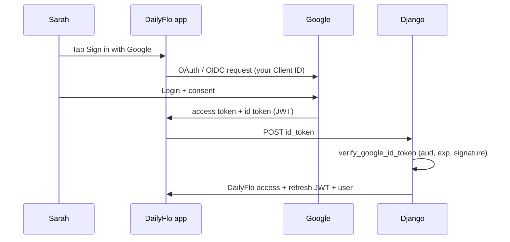

# Google authentication — mental model for DailyFlo

This guide explains **how Google Sign-In fits DailyFlo end-to-end**: tokens, OAuth clients, what Django verifies, and how that differs from manual testing and automated tests. It is written **tutorial-style** with **scenarios** and explicit **purposes** so you can reason about the flow without memorizing jargon.

**How to read it:** follow Parts **0 → 8** in order. **Part 4** is the main “Sarah signs in” story. Skip Part 0 if you already know JWT basics.

**Related code:** `backend/dailyflo/apps/accounts/social_auth.py` (`verify_google_id_token`), future `SocialAuthView`, frontend Google button + Expo AuthSession (see `social-auth-implementation-plan.md`).

---

## Part 0 — Concepts in one place

### Step 0.1 — What a JWT is (short)

A **JWT** (JSON Web Token) is a compact string: **header.payload.signature**.

| Piece | Purpose |
|-------|---------|
| **Header** | Says how it was signed (e.g. RS256). |
| **Payload** | **Claims**: facts about the login (`sub`, `aud`, `exp`, email, …). |
| **Signature** | Cryptographic proof that **Google** (holder of the private key) issued this payload—not your app, not the user typing bytes. |

Your backend **verifies** the signature using Google’s **public** keys before trusting any claim.

---

### Step 0.2 — ID token vs access token vs DailyFlo JWT

Google often returns **several** tokens after sign-in. Names confuse people—keep them separate:

| Token | Typical purpose | DailyFlo usage |
|-------|-----------------|----------------|
| **Google ID token** | OpenID Connect **identity** assertion: who signed in (`sub`, email often present). | Sent from app → Django in `id_token`; verified by `verify_google_id_token`. |
| **Google access token** | Calling **Google APIs** (Drive, Calendar, …) on behalf of the user. | Not required for “log into DailyFlo” unless you add Google API features later. |
| **DailyFlo access / refresh JWT** | Proof for **your** APIs (`Authorization: Bearer …`). | Issued by Django **after** Google ID token verifies and user row exists—**different** secret and lifetime from Google’s tokens. |

**Scenario:** Sarah finishes Google login. Her phone holds Google tokens **and** will later hold **DailyFlo** JWTs after your backend succeeds. Mixing them up causes bugs (wrong header, wrong expiry).

---

## Part 1 — OAuth Client ID (what it is and what it is not)

### Step 1.1 — Client ID = your app’s registration at Google

When you create an **OAuth 2.0 Client** in Google Cloud Console (e.g. **DailyFlo iOS**, **WebTestClient1**), Google assigns a **Client ID**—usually `….apps.googleusercontent.com`.

**Purpose:** Identify **which registered application** requested login—the DailyFlo iOS build vs a browser web client vs another company’s app.

**Not:** A per-user identifier. **Users** do not each get a Client ID.

---

### Step 1.2 — Why many teams have more than one Client ID

| Client type | Typical use | Purpose |
|-------------|-------------|---------|
| **iOS** (bundle ID) | Real DailyFlo app on iPhone | Tokens minted for native Sign-In; `aud` = iOS Client ID. |
| **Web application** | OAuth Playground, Postman, dev redirects | Tokens minted with web redirect URI; `aud` = Web Client ID. |

**Scenario:** You test with **OAuth Playground** using a **Web** client. Your production app uses **iOS**. ID tokens from Playground have **`aud` = Web client**. Tokens from the phone have **`aud` = iOS client**. Django **`GOOGLE_CLIENT_ID`** must match **`aud`** for whichever token you are verifying—so Playground testing and iPhone testing may require **different `.env` values** unless you standardize on one client everywhere (unusual across platforms).

---

## Part 2 — Claims that matter: `aud` vs `sub`

Inside the **Google ID token** payload:

### Step 2.1 — `sub` (subject)

**What it is:** Stable identifier for **that Google account** in this client context.

**Purpose:**

- Know **which human** this login refers to for linking to **`CustomUser`** (`auth_provider` + `auth_provider_id`).
- Prefer **`sub`** over raw email as the stable key (email can change or be relayed).

---

### Step 2.2 — `aud` (audience)

**What it is:** The **OAuth Client ID** this token was minted **for**.

**Purpose:**

- **Bind** the login to **one** OAuth registration—your DailyFlo client, not another app’s.
- Prevent **cross-app token reuse**: even if someone forwards a valid-looking JWT, if **`aud`** ≠ your configured **`GOOGLE_CLIENT_ID`**, verification **fails**.

---

### Step 2.3 — How they work together

| Claim | Answers | Purpose |
|-------|---------|---------|
| **`aud`** | **Which app** was this login for? | Security boundary—tokens scoped to your OAuth client. |
| **`sub`** | **Which user** at Google? | Account linking inside DailyFlo’s database. |

Google signs **one** JWT that asserts both.

---

## Part 3 — Who verifies what (trust boundaries)

### Step 3.1 — The phone must not be the authority

The app **may** decode the JWT for UI hints; **never** trust client-side checks as proof—malicious clients can forge payloads.

**Purpose of server verification:** Only Django, using **`verify_google_id_token`** (google-auth + **`GOOGLE_CLIENT_ID`**), decides whether the ID token is genuine and intended for your app.

---

### Step 3.2 — What `social_auth.py` does vs the view

| Layer | Responsibility |
|-------|------------------|
| **`verify_google_id_token`** | Cryptographic + semantic verification of the **Google ID token**; returns **claims** or raises **`ValueError`**. |
| **`SocialAuthView` (planned)** | Calls verifier → **`get_or_create`** user from **`sub`** / email → **`get_tokens_for_user`** → returns DailyFlo **access** / **refresh**. |

**Purpose of splitting:** Pure verification functions are easy to unit-test without HTTP or database.

---

## Part 4 — End-to-end flow (Sarah signs into DailyFlo)

Plain sequence:

1. Sarah opens DailyFlo and taps **Sign in with Google**.
2. **Google’s UI** opens—she authenticates with Google (password, 2FA, etc.). DailyFlo never sees her Google password.
3. Google completes OAuth/OpenID and returns tokens **to the client** (often **access token** + **ID token**).
4. The **app** sends **`provider: google`** and **`id_token`** (the JWT string) to Django **POST** (social endpoint).
5. Django runs **`verify_google_id_token`**, which checks signature, **`exp`**, issuer, and **`aud`** against **`GOOGLE_CLIENT_ID`**.
6. On success, the view uses **`sub`** (and email when present) to find or create **`CustomUser`**, then returns **DailyFlo** JWT **access** / **refresh**.
7. The app stores DailyFlo tokens (e.g. SecureStore) and uses **`Authorization: Bearer`** for API calls.

### Step 4.1 — Why Google returns tokens to the **app** first

**Purpose:** OAuth/OpenID is designed so **the party that started the login**—your registered client (mobile OAuth client + redirect / SDK)—receives the callback. Google does not POST tokens straight to your Django server unless you built a **backend-hosted OAuth** flow (different architecture). DailyFlo’s planned mobile flow: **client completes Google login → forwards ID token to Django**.

---

## Part 5 — Django configuration (`GOOGLE_CLIENT_ID`)

**Purpose:** Must equal the **Client ID of the OAuth client that minted the ID token** you verify—the **`aud`** claim inside the JWT.

**Scenario mismatch:** Playground token (Web client **`aud`**) + Django **`GOOGLE_CLIENT_ID`** set to **iOS** client → verification fails. Fix: align env with the client used to obtain that token, or obtain tokens from the client ID Django expects.

---

## Part 6 — OAuth Playground vs production vs unit tests

### Step 6.1 — OAuth Playground

**What:** Google’s browser tool to run OAuth manually with scopes and exchange codes for tokens.

**Purpose:**

- Prove Google Cloud setup (consent screen, redirect URI `https://developers.google.com/oauthplayground`, test users).
- Copy a **real** **`id_token`** for Postman once **`SocialAuthView`** exists—**full** verification path without mocks.

**Not:** A replacement for automated tests; tokens expire (~hour-scale).

---

### Step 6.2 — Unit tests (`apps/accounts/tests/test_social_auth.py`)

**Purpose:** Fast, deterministic checks on **DailyFlo’s wrapper** around google-auth.

**Google tests:** **`@patch`** replaces **`verify_oauth2_token`**—simulates “Google returned claims” or “Google raised” **without** network or real JWTs.

**What that proves:** Your code handles success and failure shapes (**`ValueError`** message, missing **`GOOGLE_CLIENT_ID`** guard).

**What it does not prove:** That Google’s servers accept a specific token—that’s Playground / real device smoke tests.

---

## Part 7 — Failure scenarios (mental rehearsal)

| Scenario | What happens |
|----------|----------------|
| Token **expired** (`exp` past) | Verifier raises → Django maps to failed login (**401** pattern). |
| Wrong **`aud`** (wrong OAuth client) | Verification fails—token not for this app. |
| **`GOOGLE_CLIENT_ID`** unset in Django | Fail fast before calling Google (**configuration error** pattern). |
| Forged / tampered JWT | Signature check fails. |

---

## Part 8 — Diagram (optional)



Plain-text summary:

```
Sarah → Google login UI → Google → tokens to APP → APP POSTs id_token → DJANGO verifies aud/sub/exp/signature → DJANGO issues DailyFlo JWT → APP stores DailyFlo tokens for API calls
```

---

## Quick glossary

| Term | Meaning |
|------|--------|
| **JWT** | Signed token with claims; ID token is one kind. |
| **Client ID** | Google’s id for **your OAuth client registration**—not per user. |
| **ID token** | Google’s proof of **who** logged in for **`aud`** client. |
| **`aud`** | Which OAuth client this token was minted for—must match **`GOOGLE_CLIENT_ID`**. |
| **`sub`** | Which Google account—use for stable user linking in your DB. |
| **DailyFlo JWT** | Your API session tokens—issued **after** Google verification succeeds. |

---

*Last aligned with DailyFlo social-auth plan (Apr 2026). Implementation details may evolve—check `social-auth-implementation-plan.md` for numbered phases.*
