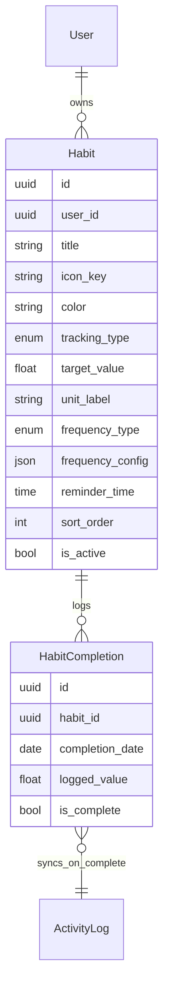
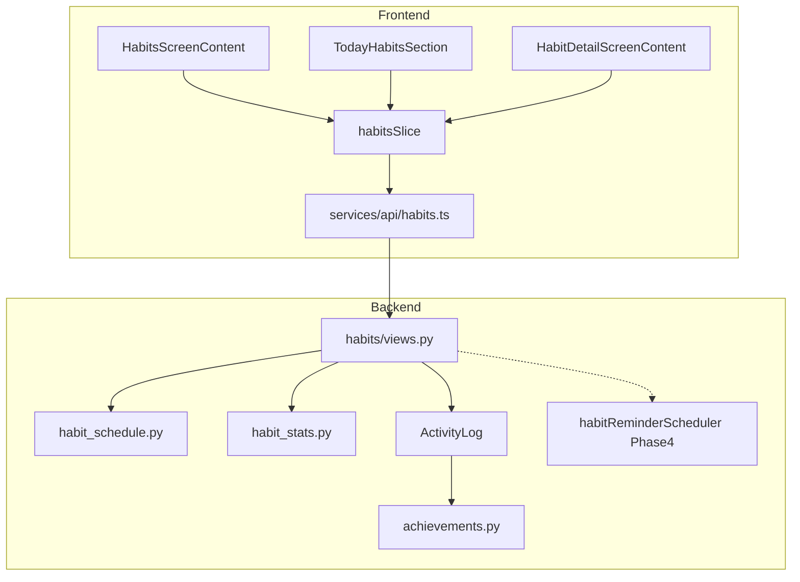

# Habits — implementation plan

**Purpose:** Define how DailyFlo ships **habit tracking** (build habits — consistency tracking separate from tasks): dedicated backend entities, Habits tab UI, Today section integration, per-habit streaks and graphs, gamification hooks, onboarding import, and phased local reminders.

**Audience:** Engineers working in `frontend/dailyflo` (Expo Router, Redux Toolkit) and `backend/dailyflo` (Django REST).

**Status:** Draft — product decisions locked via planning Q&A (2026-06-07); **no habits backend or feature UI shipped yet** (Habits tab is placeholder shell only).

**See also:**

- [`habits-manual-qa-checklist.md`](habits-manual-qa-checklist.md) — short checkbox sign-off
- [`../../../testing/habits-manual-testing.md`](../../../testing/habits-manual-testing.md) — full manual test scenarios (Phase 1–2)
- [`../../database/models.md`](../../database/models.md) — `HABITS` / `HABIT_COMPLETIONS` table schemas
- [`../../notifications/plan/notification-implementation.md`](../../notifications/plan/notification-implementation.md) — local reminder patterns (Phase 4)
- [`../../onboarding/plan/onboarding-plan.md`](../../onboarding/plan/onboarding-plan.md) — habit vs task questionnaire branch
- [`../../api/plan/tasks/tasks-api-integration.md`](../../api/plan/tasks/tasks-api-integration.md) — Redux + API service patterns to mirror
- [`../../gamification/plan/gamification-manual-qa-checklist.md`](../../gamification/plan/gamification-manual-qa-checklist.md) — global streak / achievement baseline
- [`../../../development-journals/back-log.md`](../../../development-journals/back-log.md) — living backlog
- [`../../../development-journals/dev-log.md`](../../../development-journals/dev-log.md) — habits screen scaffold shipped; feature planned here

---

## 1. Product goal (v1)

### 1.1 What ships first

| Requirement | v1 behavior |
| --- | --- |
| **Habit CRUD** | Create, edit, soft-delete habits from Habits tab (FAB + form modal route) |
| **Schedules** | `daily`, `weekly` (one weekday), `weekdays`, `weekends`, `custom` (any Mon–Sun combo), `times_per_week` (flexible count) |
| **Tracking** | **Binary** — tap to toggle done for the day. **Numeric** — optional daily `target_value`; **+1 increment** on row until target met |
| **Habits tab** | Today’s scheduled habits with completion state, per-habit current + longest streak on each row |
| **Today tab** | Separate **Habits** section above task list; **only habits due today** |
| **Detail screen** | Per-habit route with **consistency heatmap** + **rolling 7-day trend line** (30-day window) |
| **Gamification** | Tab summary header; per-habit streaks; `first_habit_completion` achievement; habit complete days also write `ActivityLog` for **global** streak / achievements |
| **Onboarding** | Import questionnaire habit answers as user’s first `Habit`; **stop** creating onboarding recurring task |
| **Reminders** | **Phase 4** — local `expo-notifications` per habit at stored `reminder_time` when habit is due that day |

### 1.2 Out of scope for v1

- **Quit / sobriety habits** (`habit_type: quit` — defer v2; sobriety / clean-time counters)
- `linked_habit` on `UserGoal` (defer v2; mirror existing `linked_task` goals later)
- Habits on **Planner** timeline
- Push notifications / Django reminder sender
- XP / levels / global leaderboards (RPG-style progression systems)
- Achievement catalog beyond **`first_habit_completion`**
- Web
- One-time migration of existing accounts’ `onboarding-habit` tasks → `Habit` rows (v1.1 backlog)

---

## 2. Current codebase baseline

### 2.1 Already shipped

| Area | Location | Notes |
| --- | --- | --- |
| Habits tab shell | `frontend/dailyflo/app/(tabs)/habits/` | Stack layout + `IosDashboardOverflowToolbar`; placeholder `HabitsScreenContent` |
| Navbar wiring | `frontend/dailyflo/components/features/settings/navigation/navigationTabRegistry.ts` | `habits` addable tab key; href `/(tabs)/habits` |
| Native tab trigger | `frontend/dailyflo/app/(tabs)/_layout.tsx` | `habits` trigger before `inbox` (Android 5-tab slot) |
| Nav prefs validation | `backend/dailyflo/apps/accounts/serializers.py`, `authSlice.ts` | `habits` in `navigation_preferences.tab_order` |
| Onboarding habit branch | `frontend/dailyflo/components/features/onboarding/onboarding/` | Questionnaire captures `goalTitle`, `frequencyId`; finish creates **recurring task** via `buildCreateTaskInputFromOnboardingAnswers` |
| Global streaks | `backend/dailyflo/apps/gamification/services/stats.py` | Calendar-day streak from `ActivityLog`; reuse helpers for per-habit stats |
| Activity logs | `backend/dailyflo/apps/tasks/models.py` → `ActivityLog` | Completion events; extend with `action_type='habit_completed'` |
| Achievements | `backend/dailyflo/apps/gamification/fixtures/achievements.json` | Add `first_habit_completion` in Phase 3 |
| Notifications infra | `frontend/dailyflo/services/notifications/` | Phase 4 habit reminder scheduler |
| UI patterns | `GoalsScreenContent`, `GroupedList`, `ListCard`, Today list | Copy browse / today chrome conventions |

### 2.2 Gaps (what v1 must add)

1. Django **`habits`** app — `Habit`, `HabitCompletion` models, serializers, views, URLs
2. **Scheduling engine** — `habit_is_due(habit, date)` for all `frequency_type` values (§3.1)
3. **Habit stats service** — per-habit streak, heatmap dates, trend series
4. Frontend **`habitsSlice`** + `services/api/habits.ts` + `types/api/habits.ts`
5. Habits tab UI — today list, create/edit modal, detail + graphs
6. **Today Habits section** — `TodayHabitsSection` in `TodayScreenContent`
7. **Onboarding migration** — `POST /habits/` on habit branch; remove habit → `createTask` path
8. **Achievement evaluator** — `habit_completion_count` criteria type
9. **Habit reminder scheduler** (Phase 4)

---

## 3. Data model

See also [`../../database/models.md`](../../database/models.md) — **Habits** section (canonical table reference).



### 3.1 `Habit` (v1)

| Field | Type | Notes |
| --- | --- | --- |
| `id` | UUID PK | |
| `user_id` | FK → `users` | CASCADE; all queries scoped by user |
| `title` | string | Required |
| `icon_key` | string | SF Symbol / icon identifier (optional) |
| `color` | enum | Reuse task color enum (`red`, `blue`, `green`, …) |
| `tracking_type` | enum | `binary` \| `numeric` |
| `target_value` | float, nullable | Required when `tracking_type=numeric`; daily target |
| `unit_label` | string, nullable | e.g. `glasses`, `minutes`, `reps` |
| `frequency_type` | enum | `daily` \| `weekly` \| `weekdays` \| `weekends` \| `custom` \| `times_per_week` |
| `frequency_config` | JSON | Shape depends on `frequency_type` (below) |
| `reminder_time` | `HH:MM`, nullable | User-local; Phase 4 scheduling |
| `sort_order` | int | User ordering within list |
| `is_active` | bool | Default `true`; soft deactivate without delete |
| `soft_deleted` | bool | Soft delete flag (match tasks pattern) |
| `created_at`, `updated_at` | datetime | Audit |

**`frequency_config` shapes:**

| `frequency_type` | JSON | Example |
| --- | --- | --- |
| `daily` | `{}` | Every calendar day |
| `weekly` | `{ "day_of_week": 0-6 }` | `0` = Sunday (match Python `weekday()` + document convention) |
| `weekdays` | `{}` | Mon–Fri |
| `weekends` | `{}` | Sat–Sun |
| `custom` | `{ "days": [0,1,2,3,4,5,6] }` | Subset of weekdays |
| `times_per_week` | `{ "target_count": N }` | N completions required per ISO week (Mon-start) |

### 3.2 `HabitCompletion` (v1)

| Field | Type | Notes |
| --- | --- | --- |
| `id` | UUID PK | |
| `habit_id` | FK → `habits` | CASCADE |
| `completion_date` | date | Calendar day in **user timezone** |
| `logged_value` | float | Default `0`; numeric habits accumulate via +1 |
| `is_complete` | bool | Binary: set `true` on toggle. Numeric: `true` when `logged_value >= target_value` |
| `created_at`, `updated_at` | datetime | |

**Constraint:** `UNIQUE (habit_id, completion_date)` — one row per habit per day.

### 3.3 Scheduling rules — `habit_is_due(habit, date)`

All dates evaluated in `user.preferences.timezone` (fallback UTC — same as gamification).

| `frequency_type` | Due on `date` when |
| --- | --- |
| `daily` | Always |
| `weekly` | `date.weekday()` matches `frequency_config.day_of_week` (document Sunday=0 convention in code comments) |
| `weekdays` | `date.weekday()` in Mon–Fri (0=Mon … 4=Fri per Python) |
| `weekends` | `date.weekday()` in Sat–Sun (5, 6) |
| `custom` | `date.weekday()` in `frequency_config.days` |
| `times_per_week` | See §3.4 |

**Not due** → habit hidden from `GET /habits/today/` and Today section for that date.

### 3.4 `times_per_week` — due-today heuristic (v1 decision)

**Rule (flexible remaining):** Habit is due on `date` when **both**:

1. `completions_this_iso_week < frequency_config.target_count`, and  
2. `remaining_calendar_days_in_week_including_today >= remaining_required_completions`

Where:

- ISO week starts **Monday** (align with gamification `_week_start` in `stats.py`).
- `completions_this_iso_week` = count of `HabitCompletion` rows for this habit with `is_complete=true` in current week.
- Prevents “save all N for Sunday” by surfacing the habit on enough days to hit the weekly target.

Document edge case: if `target_count > 7`, treat as due every day until count met (degenerate but valid).

### 3.5 ActivityLog sync on complete

When `HabitCompletion.is_complete` becomes `true` for a calendar day (first time that day):

- Insert `ActivityLog` with `action_type='habit_completed'`, `occurrence_date=completion_date`, optional `metadata.habit_id`.
- **Idempotent:** do not duplicate log if user toggles off/on same day without deleting completion row first.
- Feeds **global** `currentStreak` / `longestStreak` in `GET /gamification/summary/` alongside task completions.

When user **unchecks** (DELETE log endpoint): set `is_complete=false`; remove or soft-delete matching `ActivityLog` for that habit+date (keep global streak consistent).

---

## 4. API

Mount at `habits/` in `backend/dailyflo/config/urls.py`. Authenticated; user-scoped.

| Method | Path | Purpose |
| --- | --- | --- |
| `GET` | `/habits/` | All active, non-deleted habits (`sort_order`, `created_at`) |
| `POST` | `/habits/` | Create habit |
| `GET` | `/habits/today/` | Habits due today + completion state + `currentStreak` / `longestStreak` per row + tab summary aggregates |
| `GET` | `/habits/{id}/` | Single habit |
| `PATCH` | `/habits/{id}/` | Update habit |
| `DELETE` | `/habits/{id}/` | Soft delete (`soft_deleted=true`, `is_active=false`) |
| `POST` | `/habits/{id}/log/` | Log progress — body: `{ "date"?: "YYYY-MM-DD", "delta"?: 1 }` (default today, delta 1) |
| `DELETE` | `/habits/{id}/log/?date=YYYY-MM-DD` | Undo completion / reset numeric log for date |
| `GET` | `/habits/{id}/stats/` | Heatmap + trend + streaks (Phase 2; stub in Phase 1 OK) |

### 4.1 `POST /habits/{id}/log/` behavior

| `tracking_type` | Action |
| --- | --- |
| `binary` | Toggle `is_complete` for `date` (default today) |
| `numeric` | `logged_value += delta` (default `delta=1`); set `is_complete` when `logged_value >= target_value` |

**Response:** Updated completion row + habit summary fields (streak, `isCompleteToday`, `loggedValue`, `targetValue`).

### 4.2 `GET /habits/today/` response shape (sketch)

```json
{
  "date": "2026-06-07",
  "summary": {
    "scheduledCount": 4,
    "completedCount": 2,
    "bestActiveStreak": 12
  },
  "habits": [
    {
      "id": "...",
      "title": "Drink water",
      "trackingType": "numeric",
      "targetValue": 8,
      "loggedValue": 3,
      "unitLabel": "glasses",
      "isCompleteToday": false,
      "currentStreak": 5,
      "longestStreak": 14,
      "frequencyType": "daily"
    }
  ]
}
```

Camel-case in JSON via DRF serializer (match existing API conventions).

### 4.3 `GET /habits/{id}/stats/` (Phase 2)

```json
{
  "currentStreak": 5,
  "longestStreak": 14,
  "heatmap": { "startDate": "2025-06-07", "days": 365, "completedDates": ["2026-06-01", "..."] },
  "trend": { "windowDays": 30, "points": [{ "date": "2026-06-07", "rolling7DayRate": 0.71 }] }
}
```

`rolling7DayRate` = fraction of **scheduled** days in trailing 7 days that were completed (0–1).

---

## 5. Architecture



**Why dedicated `Habit` model (not task-only):** Dedicated habit UX needs per-habit streaks, numeric increment targets, schedule types (`times_per_week`, custom days), and analytics without cluttering Today/Planner task lists. Tasks remain the execution layer for timed calendar work; habits are consistency trackers.

---

## 6. Frontend file layout

```text
backend/dailyflo/apps/habits/
  models.py
  serializers.py
  views.py
  urls.py
  services/
    habit_schedule.py      # habit_is_due, week boundaries
    habit_stats.py         # streak, heatmap, trend series

frontend/dailyflo/
  types/api/habits.ts
  services/api/habits.ts
  store/slices/habits/habitsSlice.ts
  store/hooks.ts           # useHabits()
  components/features/habits/
    index.ts               # feature barrel
    tab/                   # habits navbar tab
      HabitsScreenContent.tsx
      HabitsTodayList.tsx
      HabitTabSummaryHeader.tsx
    list/                  # shared row
      HabitListItem.tsx
    detail/                # per-habit analytics
      HabitDetailScreenContent.tsx
      HabitHeatmap.tsx
      HabitTrendChart.tsx
    forms/                 # create + edit modals
      HabitCreateScreen.tsx
      HabitEditScreen.tsx
      habitFormConstants.ts
    today/                 # today tab section
      TodayHabitsSection.tsx

app/(tabs)/habits/
  _layout.tsx
  index.tsx
  create.tsx               # thin re-export → forms/HabitCreateScreen
  [habitId]/
    index.tsx              # detail route shell
    edit.tsx               # thin re-export → forms/HabitEditScreen
```

### 6.1 Redux integration

Mirror `gamificationSlice.ts`:

| Thunk | Trigger |
| --- | --- |
| `fetchHabitsToday` | `useFocusEffect` on Habits tab + Today tab |
| `createHabit` | FAB / onboarding finish |
| `updateHabit` | Edit form save |
| `deleteHabit` | Long-press or edit delete |
| `logHabitProgress` | Row tap / +1 button |
| `fetchHabitStats` | Habit detail focus (Phase 2) |

On `logHabitProgress.fulfilled` when `isCompleteToday` newly true:

- Dispatch `fetchGamificationSummary()` (dynamic import — same pattern as `tasksSlice` on complete).

### 6.2 Optimistic UI

- Row tap applies local state immediately; revert on API error (mirror task checkbox / `pendingCheckboxSyncRegistry` pattern).
- Short lowercase comments on thunks and API service for learning (per project convention).

### 6.3 Today integration

Insert `TodayHabitsSection` in `TodayScreenContent.tsx` **above** the task list:

- Renders only when `GET /habits/today/` returns `habits.length > 0`.
- Reuses `HabitListItem` (or slim variant) — same log thunk.
- Section header: “Habits” + optional `completedCount/scheduledCount`.

---

## 7. Onboarding migration

**File:** `frontend/dailyflo/components/features/onboarding/auth/hooks/useCompleteOnboardingAndExit.ts`

| Step | Change |
| --- | --- |
| 1 | When `answers.branch === 'habit'`: `POST /habits/` with `title` from `habit.goalTitle`, map `frequencyId` → `frequency_type` (`daily`, `weekly`, `weekends`, etc.) |
| 2 | **Remove** habit branch from `buildCreateTaskInputFromOnboardingAnswers` (or stop calling `createTask` for habit branch) |
| 3 | Continue PATCH questionnaire snapshot to profile (unchanged) |
| 4 | Map onboarding `weekends` → `frequency_type: weekends` (no longer downgrade to `daily` on task) |

**Frequency mapping:**

| Onboarding `frequencyId` | `frequency_type` | `frequency_config` |
| --- | --- | --- |
| `daily` | `daily` | `{}` |
| `weekly` | `weekly` | `{ "day_of_week": <wake-day or Monday default> }` — document pick in implementation |
| `weekends` | `weekends` | `{}` |

**Existing users:** Accounts with `metadata.tags` containing `onboarding-habit` on a task — **no auto-migration in v1** (v1.1 script backlog).

---

## 8. Gamification integration

| Feature | Phase | Implementation |
| --- | --- | --- |
| Per-habit streak on row | 1 | `habit_stats.py` — port `_current_streak` / `_longest_streak` from `stats.py` scoped to one habit’s `completion_date` set where `is_complete=true` |
| Tab summary header | 3 | `HabitTabSummaryHeader` — `completedCount/scheduledCount`, `bestActiveStreak` from `GET /habits/today/` |
| Global streak | 1 | `ActivityLog` on habit complete (§3.5) |
| `first_habit_completion` | 3 | New `AchievementDefinition` fixture; criteria `{ "type": "habit_completion_count", "min": 1 }`; extend `achievements.py` evaluator |

**Deferred v2:** `linked_habit` on `UserGoal`, per-habit streak achievements (3/7/30), perfect habit week.

---

## 9. Graphs (Phase 2)

| Graph | Data | UI component |
| --- | --- | --- |
| **Consistency heatmap** | `stats.heatmap.completedDates` — last 365 days | `HabitHeatmap.tsx` — GitHub-style cell grid; color by theme |
| **Trend line** | `stats.trend.points` — rolling 7-day completion rate, 30-day window | `HabitTrendChart.tsx` — SVG polyline or lightweight chart; no heavy chart lib required v1 |

**Entry:** Tap habit row → `/(tabs)/habits/[habitId]` (stack push inside habits tab).

---

## 10. Reminders (Phase 4)

Reuse [`notification-implementation.md`](../../notifications/plan/notification-implementation.md) patterns:

| Event | Action |
| --- | --- |
| Habit create/update | If `reminder_time` set and habit due today → schedule local notification |
| Habit delete / deactivate | Cancel pending expo id for habit |
| Logout | Include habit ids in `cancelAll` sweep (extend reminder storage map) |
| Daily rollover | Resync on `fetchHabitsToday` focus (v1.1) |

**Copy (v1):** `{habitTitle} — time for your habit` (tune in `habitReminderCopy.ts`).

**Eligibility:** Same gates as task reminders — OS permission + `user.preferences.notifications.enabled`.

---

## 11. Implementation phases

### Phase 1 — MVP (tracking + Today)

- [ ] Django `habits` app + migrations
- [ ] `habit_schedule.py`, `habit_stats.py` (streak only)
- [ ] CRUD + `today` + `log` + `DELETE log` endpoints
- [ ] `types/api/habits.ts`, `services/api/habits.ts`, `habitsSlice.ts`
- [ ] Replace `HabitsScreenContent` — summary stub + `HabitsTodayList` + FAB
- [ ] `habits/create.tsx` modal — binary + numeric + all frequency types
- [ ] `HabitListItem` — toggle + numeric +1 + streak display
- [ ] `TodayHabitsSection` on Today tab
- [ ] Onboarding → `POST /habits/`; deprecate habit → task
- [ ] `ActivityLog` sync on complete; refresh gamification summary

**Exit criteria:** User creates habit, checks off on Habits + Today, per-habit streak updates, global streak includes habit days.

### Phase 2 — Detail + graphs

- [ ] `GET /habits/{id}/stats/`
- [ ] `app/(tabs)/habits/[habitId].tsx` + `_layout` registration
- [ ] `HabitDetailScreenContent`, `HabitHeatmap`, `HabitTrendChart`
- [ ] Edit habit from detail (reuse form)

**Exit criteria:** Heatmap + 30-day trend visible; matches §4.3 analytics spec.

### Phase 3 — Gamification polish

- [ ] `HabitTabSummaryHeader` on Habits tab
- [ ] `first_habit_completion` fixture + evaluator
- [ ] Unlock feedback (reuse achievements screen patterns / light haptic)

**Exit criteria:** First habit check-off unlocks achievement; tab summary reflects today’s progress.

### Phase 4 — Reminders

- [ ] `habitReminderScheduler.ts` + storage map
- [ ] Wire create/update/delete + logout
- [ ] Reminder time field on create/edit form
- [ ] Manual QA — notification fires when due

**Exit criteria:** OS local notification at `reminder_time` on due days.

---

## 12. Platform notes

### iOS

- Habits tab is standalone native tab (`app/(tabs)/habits/`) — no browse-stack slide transition.
- Heatmap/trend scroll inside habit detail should use `contentInsetAdjustmentBehavior` consistent with other dashboard screens.

### Android

- Habits occupies **5th** `NativeTabs.Trigger` slot (before inbox); inbox navbar href falls back to `/(tabs)/browse/inbox` via `resolveNavTabHref()` when needed.
- Habit reminders: `dailyflo-reminders` channel (existing).

### Timezone

- All `completion_date` values are **calendar dates** in `user.preferences.timezone` (same rule as `stats.effective_completion_date`).

### Offline

- Optimistic log on row; queue retry or revert with inline error state on failure.

---

## 13. Testing plan

Primary checklist: **[habits-manual-qa-checklist.md](habits-manual-qa-checklist.md)**.

| Area | Phase |
| --- | --- |
| CRUD + each frequency type | 1 |
| Binary toggle + numeric +1 to target | 1 |
| Habits tab + Today section parity | 1 |
| Streak across midnight (timezone) | 1 |
| Onboarding habit import | 1 |
| Global streak after habit complete | 1 |
| Heatmap + trend | 2 |
| `first_habit_completion` | 3 |
| Local reminder | 4 |

---

## 14. Open decisions

| # | Decision | Options | v1 recommendation |
| --- | --- | --- | --- |
| 1 | `times_per_week` due rule | Fixed weekday slots vs flexible remaining | **Flexible remaining** (§3.4) |
| 2 | Trend window | 30 vs 90 days | **30 days** |
| 3 | Legacy `onboarding-habit` tasks | Migration script vs ignore | **Ignore v1**; v1.1 backlog |
| 4 | Create route | Stack modal `habits/create` vs root modal | **`habits/create`** (mirror `goal-create`) |
| 5 | Onboarding `weekly` default day | User wake day vs fixed Monday | **Day of week from wake time ISO date** |

---

## 15. Backlog alignment

| Backlog item | Doc section |
| --- | --- |
| dev-log: “plan to implement habits screen and feature” | This doc — Phase 1+ |
| onboarding habit branch → task create | §7 — replace with `POST /habits/` |
| Gamification before habits (dev-log May note) | §8 — habit completions feed existing `ActivityLog` pipeline |
| `ROUTINES` table in `models.md` | Habits are **separate** from planned Routines entity — do not conflate |

Update [`back-log.md`](../../../development-journals/back-log.md) when Phase 1 ships.

---

## 16. Changelog

| Date | Change |
| --- | --- |
| 2026-06-07 | Initial draft from product Q&A feature mapping |
